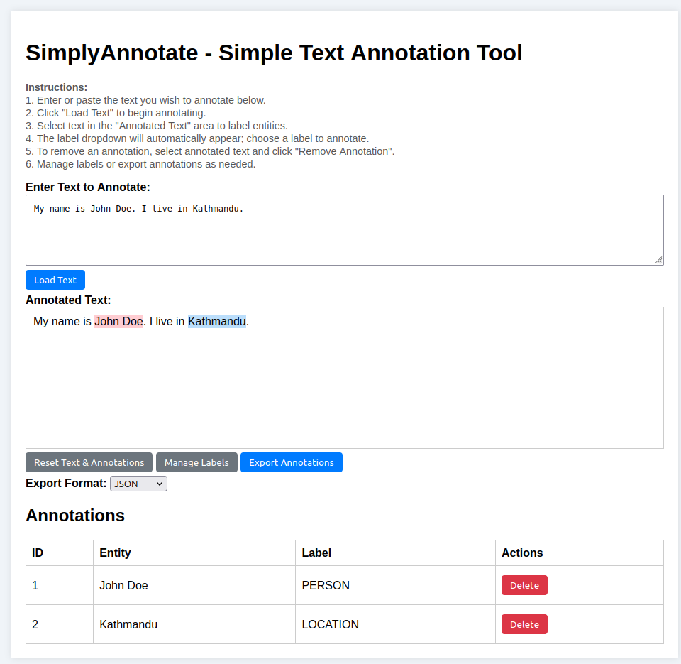

# SimplyAnnotate - Simple Text Annotation Tool

This project is a simple Flask-based web application for annotating text, specifically for Named Entity Recognition (NER) tasks. It allows you to load text, select portions for annotation, manage labels, and export annotations in various formats like CSV, JSON, TXT, and CoNLL-U.

## Features

- Load and annotate text for NER tasks.
- Highlight selected text and label it with predefined or custom labels.
- Easily remove annotations.
- Export annotations in different formats: CSV, JSON, TXT, and CoNLL-U.
- Manage labels: add, edit, and delete.
- Reset text and annotations as needed.

## Setup and Installation

### Step 1: Clone the Repository
Start by downloading the project files by cloning the repository or downloading the zip directly.

### Step 2: Create a Virtual Environment
It’s recommended to use a virtual environment to manage dependencies. Here’s how to create one:

- For Windows:
            
        python -m venv venv

- For macOS/Linux:
  
        python3 -m venv venv

### Step 3: Activate the Virtual Environment

- On Windows:

        venv\Scripts\activate

- On macOS/Linux:

        source venv/bin/activate

### Step 4: Install Dependencies

With the virtual environment activated, install the necessary dependencies by running:

    pip install -r requirements.txt

### Step 5: Run the Application

To start the application, use the following command:

    python app.py

Open your browser and navigate to `http://localhost:5000/` to start using SimplyAnnotate.

## Usage

1. **Load Text**: Paste or type the text you want to annotate into the provided text area and click "Load Text."
2. **Annotate**: Select any part of the loaded text, and a dropdown will automatically appear, allowing you to label the selected text.
3. **Manage Labels**: You can add, edit, or delete labels using the "Manage Labels" button.
4. **Export**: After annotating, you can export the annotations in CSV, JSON, TXT, or CoNLL-U formats.
5. **Reset**: You can reset the text and annotations by clicking the "Reset" button.

## Export Options

- **CSV**: Exports the annotations in CSV format.
- **JSON**: Exports the annotations in JSON format.
- **TXT**: Exports the annotations as plain text.
- **CoNLL-U**: Exports the annotations in CoNLL-U format for use with other NLP tools.

## Directory Structure

- **app.py**: The main application logic for the Flask app.
- **templates/**: Contains HTML files used for the frontend.
- **data.json** and **labels.json**: Auto-generated files where text and label data are stored (not tracked in version control).

## Deactivating the Virtual Environment

After you're done, deactivate the virtual environment by running:

    deactivate

## License

This project is licensed under the MIT License. You are free to use, modify, and distribute this tool, provided that proper credit is given to the original author.
